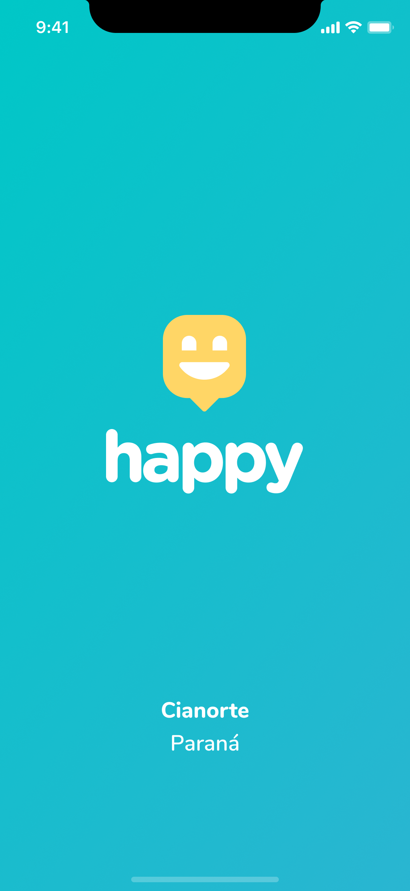

<h1 align="center">
  
</h1>

  <a href="#about">About</a>&nbsp;&nbsp;&nbsp;
  <a href="#project">Project</a>&nbsp;&nbsp;&nbsp;
  <a href="#Technologies">Technologies</a>&nbsp;&nbsp;&nbsp;

##  About
**Happy** Visit orphanages and change the day of many children.

##  Project

  
  

##  Technologies
Technologies used in the project.

- [NodeJS](https://nodejs.org/)
- [TypeScript](https://www.typescriptlang.org/)
- [ReactJS](https://reactjs.org/)
- [React Native](https://reactnative.dev/)

## 

<h4 align="center">
    Feito com :heart: by <a href="https://www.linkedin.com/in/joseadilson/" target="_blank">José Adilson</a>
</h4>
